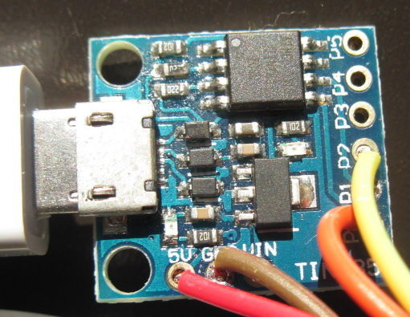
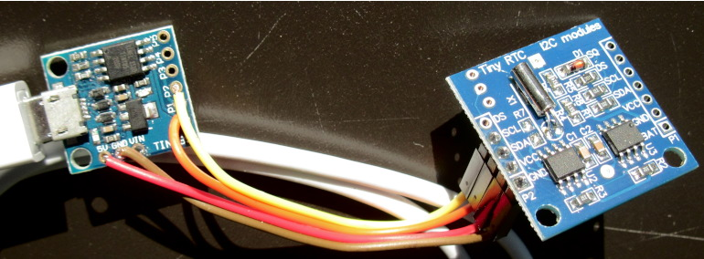
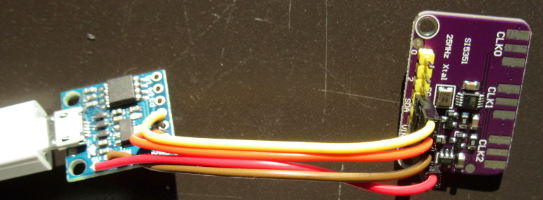

# I2Shell

I2Shell is a simple interactive wrapper between a USB serial port and an I2C port. It permits to send and receive bytes to/from an I2C device, either in an interactive or scriptable method.

It is made to be programmed on a USB-enabled ATTINY85 device such as the Trinket or any low-cost [Digispark](http://digistump.com/products/1) such as the board below that I used:



This board can the be connected with 4 independent wires to various I2C devices:



The principle is that all bytes and addresses are read and written in hexadecimal, which removes the need for escaping anything. There are few commands that are easy to remember and which are quite tolerant to the lack or excess of delimiters.

As such the tool is convenient to use directly from shell scripts, either for experimentation or for setting up devices.

## Device connections

The I2C connections to the ATTINY85 are very easy:
- SDA is pin P0
- SCL is pin P2
- GND goes to GND
- VCC goes to +5V or +3v3 depending on the board

## Programming

Just load the program into an Attiny85-enabled Arduino IDE, install [Adafruit's TinyWireM](https://github.com/adafruit/TinyWireM) and [DigistumpArduino](https://github.com/digistump/DigistumpArduino/tree/master/digistump-avr) libraries and program the device.

## Accessing the device

For interactive operations, any terminal emulator able to open a `ttyACM` device will work:
- CU: `cu -l /dev/ttyACM1`
- minicom: `minicom -D /dev/ttyACM1`
- [bootterm](https://github.com/wtarreau/bootterm): `bt /dev/ttyACM1`

For scripted operations, `socat` is particularly convenient because it supports exchanging raw data with stdio, it only requires `,rawer` to be appended to the device's name:
```
$ socat /dev/ttyACM1,rawer - <<< "S68W0R7"
35 05 00 01 01 01 00
```
While `socat` will automatically stop 0.5s after the last byte is dumped, it is also possible to make it exit even faster when the number of bytes to be dumped is known. For reads, this is typically 3N+2, so when reading 7 bytes as above, that's 23 total bytes that are retrieved:
```
$ time socat /dev/ttyACM1,rawer - <<< "S68W0R7"
09 00 00 01 01 01 00 
real    0m0.662s

$ time socat /dev/ttyACM1,rawer,readbytes=23 - <<< "S68W0R7"
10 00 00 01 01 01 00 
real    0m0.167s
```

## Commands

I2Shell currently knows the following commands:

  - `?` : prints the help message, listing supported commands
  - `S <addr>` : sets the device's address to be used for subsequent read/write commands. The address has to be provided in hexadecimal and is a 7-bit address (`00` to `7F`).
  - `W <byte>* P` : writes all indicated bytes as a single I2C bus transaction, and closes when the `P` ("push") command is met.
  - `R <num>` : reads this number of bytes from the bus and displays them in hexadecimal. Note that <num> has to be provided in hexadecimal as well.
  - `P` : push, i.e. finish a write transaction.

All commands and hex values are case-insensitive, and non-ambiguous spaces are not needed. As such, "W36 4c p" is the same as "w36 4C P" or as "w36 4cp".

## Note

Many I2C devices will consider that the first byte written in a write sequence is the address of a configuration register send subsequent bytes to that register and the next one by applying an auto-increment mechanism of that register address. The same often works for reads, where a preliminary one-byte write sets the register address, and subsequent reads will retrieve registers starting from this one. This explains why it is often not the same to perform a single two-byte write and two one-byte writes.

## Manipulating values from Bash

Reading bytes is often conveniently done using the `set` command that sets an array. Example:
```
$ set -- $(socat /dev/ttyACM1,rawer,readbytes=23 - <<< "S68W0R7")
$ echo "bytes read=$#: $1 $2 $3 $4 ..."
bytes read=8: 12 17 00 01 ...
```

One more byte is always reported for the CRLF at the end of the line. Converting a value to decimal is as simple as prepending `0x` in front of it inside an expression evaluation `$(( ))`:
```
$ echo "arg1 ='$1' =$((0x$1))"
arg1 ='12' =18
```

Sending hex values is done using `printf "%x"`:
```
$ printf "S68 W0 %x %x P\n" 35 60
S68 W0 23 3c P
```

Thus setting the time (seconds minutes hours) on the DS1307 is just a matter of sending these 3 values:
```
hour=12; min=05; sec=34
$ printf "S68 W0 %x %x %x P" $sec $min $hour | socat /dev/ttyACM1,rawer -
$ socat /dev/ttyACM1,rawer,readbytes=23 - <<< "W0R7"
29 05 0C 01 01 01 00
```

## Examples

Initialize a DS1307 RTC clock device by writing 0 to register 0 of device address 0x68 :
```
$ socat /dev/ttyACM1,rawer - <<< "S68 W0 0P"
```

Read the current date and time from the 7 first bytes of a DS1307 RTC:
```
$ socat /dev/ttyACM1,rawer - <<< "S68 W0 R7"
12 09 00 01 01 01 00
```

Configure an Si5351A clock generator to 1 MHz (address 0x60):
```
# set device address to 0x60
$ socat - /dev/ttyACM1  <<< "S 60"
# configure registers
$ socat - /dev/ttyACM1  <<< "W 3 ff P"
$ socat - /dev/ttyACM1  <<< "W 10 80 80 80 80 80 80 80 80 P"
$ socat - /dev/ttyACM1  <<< "W F 0 P"
$ socat - /dev/ttyACM1  <<< "W 18 0 P"
$ socat - /dev/ttyACM1  <<< "W 2 F0 P"
$ socat - /dev/ttyACM1  <<< "W 1A FF FF 00 0A 00 F0 00 00 P"
$ socat - /dev/ttyACM1  <<< "W 2A 00 01 01 2A 00 00 00 00 P"
$ socat - /dev/ttyACM1  <<< "W B1 AC P"
$ socat - /dev/ttyACM1  <<< "W B7 D2 P"
$ socat - /dev/ttyACM1  <<< "W 10 4F P"
$ socat - /dev/ttyACM1  <<< "W 3 FE P"
```
